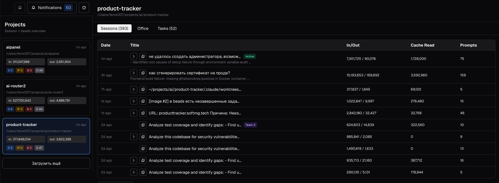
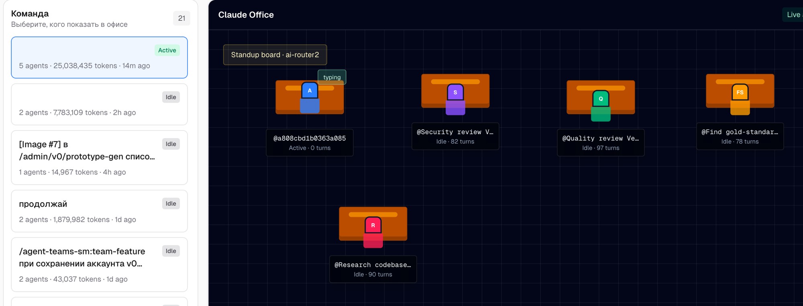
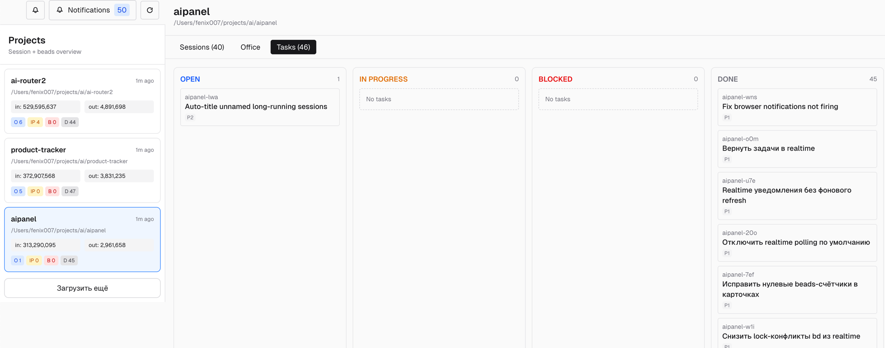

# aipanel

Локальная панель для просмотра Claude sessions, наблюдений из claude-mem и kanban-задач из beads.







## Требования

- Node.js 20+
- pnpm
- установлен `bd` ([beads CLI](https://github.com/gastownhall/beads))
- локальная база [claude-mem](https://github.com/thedotmack/claude-mem) по пути `~/.claude-mem/claude-mem.db`
- хотя бы один проект с историей Claude Code (`~/.claude/projects/...`)

## Проекты

aipanel автоматически находит проекты из истории Claude Code (`~/.claude/projects/...`), поэтому `projects.json` создавать не обязательно.

Создайте `projects.json`, только если хотите явно настроить список проектов: задать имена, отключить лишние проекты или указать конкретные пути.

```bash
cp projects.example.json projects.json
```

Пример `projects.json`:

```json
{
  "projects": [
    {
      "path": "/absolute/path/to/project",
      "name": "project-name",
      "enabled": true
    }
  ]
}
```

`path` может быть абсолютным или в формате `~/...`.

## Подключение claude-mem

aipanel читает SQLite-файл `~/.claude-mem/claude-mem.db` в read-only режиме.

Проверьте, что файл существует:

```bash
ls ~/.claude-mem/claude-mem.db
```

Если файла нет, сначала инициализируйте claude-mem в вашей среде.

## Подключение beads

aipanel читает beads через CLI-команду `bd list --all --format json` в директории каждого проекта из `projects.json`.

Для каждого проекта:

1. Убедитесь, что `bd` доступен:

```bash
bd --version
```

2. Убедитесь, что в проекте есть `.beads/` (если нет, выполните `bd init` в директории проекта).

3. Проверьте, что beads возвращает JSON:

```bash
cd /absolute/path/to/project
bd list --all --format json
```

## Локальный запуск

Установите зависимости:

```bash
pnpm install
```

Создайте локальный env-файл:

```bash
cp .env.example .env.local
```

Запустите dev-сервер:

```bash
make dev
```

Откройте URL из терминала (например, `http://localhost:3000`).

## LAN-запуск (опционально)

Разовый запуск с переменной окружения:

```bash
AIPANEL_ALLOWED_DEV_ORIGINS=localhost,100.89.42.77 make dev
```

Постоянно через `.env.local`:

```bash
AIPANEL_ALLOWED_DEV_ORIGINS=localhost,100.89.42.77
```

## Browser push-уведомления (во вкладке)

Для включения системных уведомлений браузера (пока вкладка aipanel открыта):

```bash
NEXT_PUBLIC_AIPANEL_BROWSER_NOTIFICATIONS_ENABLED=true
```

Далее в интерфейсе нажмите `Enable push` и подтвердите permission в браузере.

Ограничения:
- работает только при открытой вкладке aipanel;
- при активной видимой вкладке OS-уведомления не показываются;
- включён dedupe и rate-limit, чтобы не спамить повторяющимися событиями.

## Если данные не появились

- Нет beads-задач: проверьте `bd --version`, наличие `.beads/` и вывод `bd list --all --format json`.
- Нет observations из claude-mem: проверьте наличие `~/.claude-mem/claude-mem.db`.
- Проект не виден в sidebar: проверьте `projects.json` и поле `"enabled": true`.
